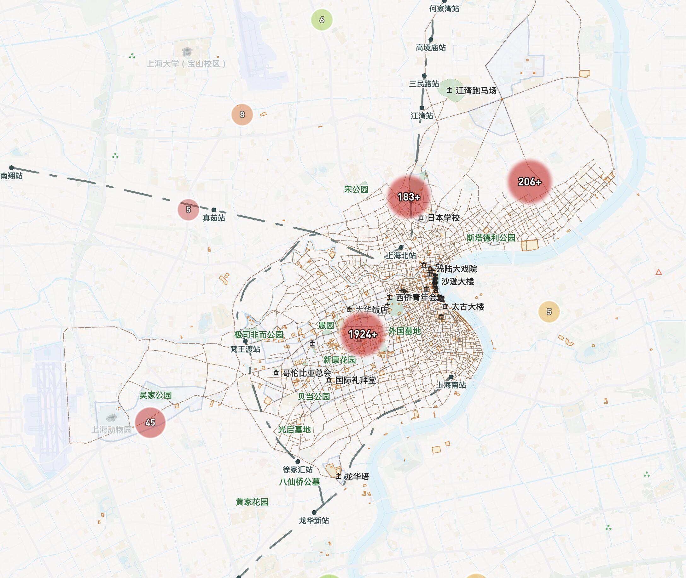
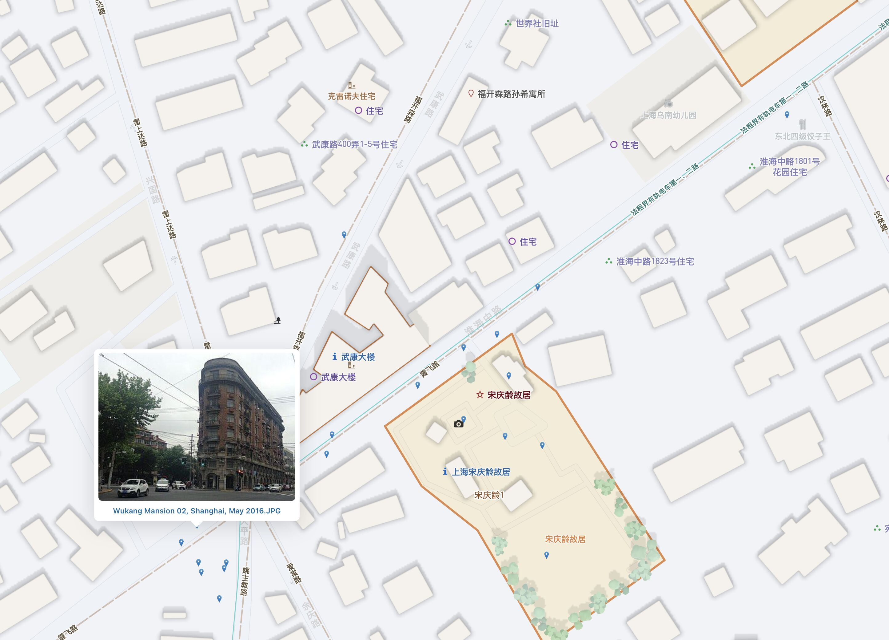
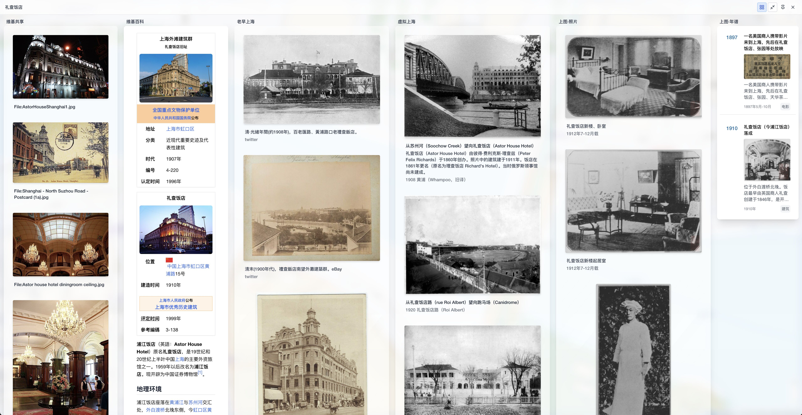

# 上海历史建筑地图:

https://shanghai-heritage-map.openda.top/

#### 坐标数据

1. 上海图书馆开放数据平台

   - [上海年华-上海市优秀历史建筑(1086)](https://data.library.sh.cn/shnh/wkl/webapi/building/toAllBuilding)
   - [上海年华-上海市不可移动文物名录(3452)](https://data.library.sh.cn/shnh/wkl/webapi/hsly/building/toRelicDirectory)

2. [地图书: 上海历史建筑数字地图集](https://www.ditushu.com/book/645/table)
3. [OpenStreetMap（polygon:674, point:717）](https://overpass-turbo.eu/)
   <details><summary>查询语句</summary>

   ```sql

   /*
   Overpass API 查询 -
   */

   [out:json][timeout:120];

   // 1. 定义搜索区域
   area["name:en"="Shanghai"]->.searchArea;

   // 2. 在指定区域内执行并集查询（OR 关系）
   (
   // 原有的文化遗产和历史遗迹
   nwr["heritage"](area.searchArea);
   nwr["historic"](area.searchArea);

   // 旅游景点和标志性地点
   nw["tourism"~"^(attraction|museum|gallery|artwork|viewpoint|monument)$"][!"area"]["leisure"!="park"](area.searchArea);
   );

   // 3. 输出结果
   // 输出完整的几何信息和所有标签
   out geom;
   ```

   </details>

4. [Wikidata（1580）](https://query.wikidata.org/)
   <details><summary>查询语句</summary>

   ```sql

   # 终极地理空间查询：在上海地理范围内，查找所有文物保护单位 (由于文保单位有限， 查找范围扩大至所有含有坐标)
   SELECT DISTINCT ?item ?itemLabel ?itemDescription ?coords ?heritage_statusLabel ?image ?zhwiki_url ?commons_url WHERE {

   # 核心逻辑：查找所有 ?item，其“位于行政区实体”(P131)是“上海市”(Q8686)或其下级行政区
   # *号表示递归查找，能包含所有区
   ?item wdt:P131* wd:Q8686.

   # 筛选条件：该条目必须有“坐标”(P625)属性
   ?item wdt:P625 ?coords.

   # 筛选条件：条目拥有“文物保护等级”(P1435) 属性
   # ?item wdt:P1435 ?heritage_status .
   OPTIONAL { ?item wdt:P1435 ?heritage_status. }

   # 可选地获取图片 (P18)
   OPTIONAL { ?item wdt:P18 ?image. }

   # 可选地获取中文维基百科的链接
   OPTIONAL {
       ?zhwiki_url schema:about ?item .
       FILTER(STRSTARTS(STR(?zhwiki_url), "https://zh.wikipedia.org/"))
   }

   # 可选地获取维基共享资源的链接 (P373)
   OPTIONAL {
       ?item wdt:P373 ?commonsCategoryName.
       BIND(IRI(CONCAT("https://commons.wikimedia.org/wiki/Category:", ENCODE_FOR_URI(?commonsCategoryName))) AS ?commons_url)
   }


   # 获取标签
   SERVICE wikibase:label { bd:serviceParam wikibase:language "zh,en". }
   }

   ```

   </details>

5. [WikiMap](https://wikimap.toolforge.org/?wp=false&cluster=false&zoom=16&lat=031.245900&lon=0121.485733)

6. [Virtual Shanghai Buildings（1803）](https://www.virtualshanghai.net/Data/Buildings)

#### 查询数据

1. 维基百科
2. 维基共享
3. [Virtual Shanghai Images（5860）](https://www.virtualshanghai.net/Photos/Images)
4. [上海图书馆·老照片（33397）](https://scc.library.sh.cn/#/result)
5. [上海图书馆·年谱（16091）](https://scc.library.sh.cn/#/np/result)
6. [老早上海（2747）](https://laozaoshanghai.com/)

#### 快捷键

- `鼠标放在地图的符号、标签上`，会自动弹出查询面板，这时候，点击`鼠标左键`或按`Space`键，可以全屏展示。
- `ArrowLeft`, `ArrowRight` 快速切换查询面板 tab 显示。
- 查询面板全屏时，`Space` 键快速切换概览和 tab 显示（会自动切换到`鼠标`所在的 tab）

#### 截图





